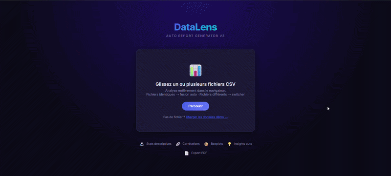

# 📊 DataLens v3 — Auto Report Generator

[](https://bran9910.github.io/DataLens/DataLens.html)
[](LICENSE)
[](DataLens.html)

> A self-contained, single-file analytics dashboard with an integrated AI assistant.
> No server, no install, no build step — just open the HTML file in your browser.

🔗 **[Live Demo →](https://bran9910.github.io/DataLens/DataLens.html)**

---

<!-- Replace the line below with your actual GIF once recorded -->
<!--  -->

---

## ✨ Features

- **Drag & drop CSV import** — auto-detects column types (numeric, categorical, date); supports Excel-exported files with BOM encoding
- **Interactive charts** — bar, line, pie, donut, scatter, radar, histogram, and boxplot views via Chart.js
- **Statistical summary** — min, max, mean, median, standard deviation per column
- **Correlation heatmap** — highlights relationships between numeric variables
- **Auto insights** — automatically surfaces key trends, outliers, and patterns in plain language
- **AI assistant** — conversational interface aware of your dataset, with support for multiple AI backends (Ollama, OpenRouter, Groq, Custom)
- **Dark mode** — full theme switch with persistent preference (localStorage)
- **Export PDF** — generates a printable, standalone report from the current dashboard
- **Bilingual UI** — French / English interface
- **Zero-install** — no Node.js, no Python, no build step; works from `file://` or any HTTP server

---

## 🚀 Getting Started

### Option A — Live (no install)

Open the app directly in your browser:
👉 **[bran9910.github.io/DataLens/DataLens.html](https://bran9910.github.io/DataLens/DataLens.html)**

Click **"Charger les données démo"** to explore with sample data, or drop your own CSV file.

### Option B — Run locally

```bash
# Clone the repo
git clone https://github.com/bran9910/DataLens.git
cd DataLens

# Open directly (no AI features requiring CORS)
open DataLens.html

# Or serve locally (required for Ollama local AI)
python -m http.server 8080
# → http://localhost:8080/DataLens.html
```

---

## 🤖 AI Assistant Setup

The AI panel supports four provider modes. Switch between them using the **Provider** dropdown.

### 🏠 Ollama (local, recommended for privacy)

Connects to a locally running [Ollama](https://ollama.com) instance at `http://localhost:11434`.
100% private — your data never leaves your machine.

```bash
# Pull a model
ollama pull llama3.2
ollama pull mistral

# Start with browser access enabled
OLLAMA_HOST=0.0.0.0 OLLAMA_ORIGINS=* ollama serve
```

**Running Ollama in WSL?** Bind to all interfaces so Windows can reach it:
```bash
OLLAMA_HOST=0.0.0.0 OLLAMA_ORIGINS=* ollama serve
```
Then check `http://localhost:11434` in your Windows browser — you should see `Ollama is running`.

---

### 🌐 OpenRouter (free tier available)

[OpenRouter](https://openrouter.ai) gives access to dozens of models (Llama, Mistral, DeepSeek, Gemini…) with a free tier and no credit card required.

1. Create an account at [openrouter.ai](https://openrouter.ai)
2. Generate a key at [openrouter.ai/keys](https://openrouter.ai/keys)
3. Paste it (`sk-or-v1-…`) into the **API Key** field in the app
4. If you see a 404, enable **Allow all providers** at [openrouter.ai/settings/privacy](https://openrouter.ai/settings/privacy)

---

### ⚡ Groq (very fast, generous free tier)

[Groq](https://groq.com) offers extremely fast inference (LPU hardware) — 14,400 free requests/day.

1. Create an account at [console.groq.com](https://console.groq.com)
2. Generate a key at [console.groq.com/keys](https://console.groq.com/keys)
3. Paste it (`gsk_…`) into the **API Key** field

---

### ⚙️ Custom (any OpenAI-compatible endpoint)

Enter any base URL following the OpenAI API format (`/v1/chat/completions`).
Compatible with LM Studio, vLLM, llama.cpp server, and other self-hosted models.

---

## 📊 Provider Comparison

| Provider | Cost | Privacy | Setup |
|---|---|---|---|
| Ollama (local) | Free | ✅ 100% local | Install Ollama + pull a model |
| OpenRouter | Free tier | Data sent to provider | API key |
| Groq | Free tier | Data sent to Groq | API key |
| Custom | Varies | Depends on endpoint | URL + optional key |

---

## 🛠 Tech Stack

| Layer | Technology |
|---|---|
| UI & logic | Vanilla HTML / CSS / JavaScript (ES2020) |
| Charts | [Chart.js 4.5](https://www.chartjs.org/) |
| CSV parsing | [PapaParse 5.4](https://www.papaparse.com/) |
| Fonts | Inter (Google Fonts) |
| Hosting | GitHub Pages |

---

## 📁 Project Structure

```
DataLens/
├── DataLens.html    # Entire application — single self-contained file
├── index.html       # GitHub Pages redirect → DataLens.html
└── README.md        # This file
```

---

## 📝 Statistical Notes

- **Quartile method**: Q1/Q3 use the *nearest-rank* method (`Math.floor(n × 0.25/0.75)`). Results may differ slightly from software using linear interpolation (R, SPSS). This is intentional — it keeps the implementation dependency-free and runs fast in the browser.

---

## 📌 Roadmap

- [ ] Persistent chat history per dataset
- [ ] Shareable dashboard URLs (via URL-encoded state)
- [ ] Multi-file join / merge support
- [ ] Dark mode export (PDF preserves current theme)

---

## 📄 License

MIT — free to use, modify, and distribute.

---

*Built by [Sidney Rabehamina](https://github.com/bran9910) · Madagascar 🇲🇬*
